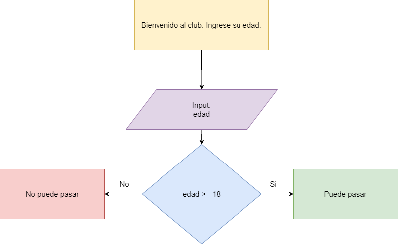
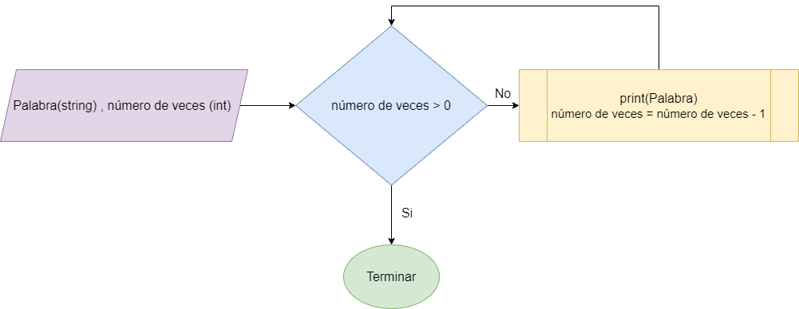

# Taller Introductorio a la programación con Python

Ofrecido por:

- Arnaldo Torres
- Carlos Oriol

## Agenda

- ¿Qué es la programación?
- ¿Qué es un lenguaje de programación?
- ¿Qué es el procesador y memoria de una computadora?
- ¿Qué necesito para comenzar a programar?
- Comencemos con Python
- Últimos comentarios

---

## ¿Qué es la programación?

- La programación es una forma de dar a las computadoras **instrucciones** sobre la tarea que van a hacer.
- Estas instrucciones son otorgadas mediante *código*, y los programadores escriben código para resolver problemas o realizar una tarea.

### ¿Para qué se usa?

- Manera de **comunicarse con las computadoras**.
- Permite **automatizar una tarea**.
- Llevar a cabo una operación que podría consumir mucho tiempo.

:max_bytes(150000):strip_icc()/pexels-photo-270348-598f140868e1a20011c6ec6b.jpg)

---

## ¿Qué es un lenguaje de programación?

- Es un *lenguaje estructurado* que, mediante una serie de reglas, le permite a un desarrollador crear programas que controlen el comportamiento físico (*hardware*) y lógico (*software*) de una computadora.

- Constantemente, nos referimos al lenguaje de programación como *código*.

- Antes de que la computadora pueda ejecutar las instrucciones que se le está otorgando, **el código pasa por una transformación**.

- El lenguaje debe ser *interpretado o compilado* a *lenguaje de máquina*.

- En resumen, la computadora necesita que alguien hable su idioma.

*Logos de lenguajes de programación*


### ¿Por qué existen muchos lenguajes de programación y cómo se diferencian?
- Cada lenguaje cumple con un cierto propósito.

- Algunos lenguajes realizan mejor una tarea que otro.

- También, algunos lenguajes de programación tienden a ser mucho más fáciles de aprender que otros.

- La sintaxis es distinta
  - La sintaxis se puede decir que es la gramática y ortografía del lenguaje de programación.
  - Define las reglas de como el lenguaje debe ser escrito.

- Cabe destacar que no es necesario saberlos todos. 
  - Lo bueno es que existen muchas alternativas. 
  - No tienes que limitarte a un solo lenguaje.
  
- Una vez aprendas uno, aprender otro es sencillo. Dado que estos tienen muchas similitudes.

---

## Procesador

- El **procesador** o **CPU** (Central Processing Unit) es el cerebro de la computadora lleva a cabo las instrucciones y cálculos intensivos de la esta.


## Memoria
- La **memoria**, también conocida como **RAM** (Random Access Memory), es donde la computadora almacena *temporeramente* la información. 

- La computadora necesita "*recordar*" información que va a utilizar en el futuro.

- La memoria permite acceder y obtener de forma rápida y eficiente un dato guardado.
  - Imagina una tabla de Excel.
  
- Cuando ya se no necesita esta información, la memoria es *liberada* o *limpiada*.

- Las aplicaciones, se cargan en la memoria.


---

## ¿Qué necesito para comenzar a programar?

Sencillo:

- Una computadora

- Un editor de texto
  - Al fin al cabo, el código es texto.
  - Puede ser cualquier editor, sin embargo, existen editores que tienen las herramientas necesarias para editar código de manera eficiente y limpia.
  - Estaremos usando [Visual Studio Code](https://code.visualstudio.com/downloads), un editor de texto y ambiente de desarrollo gratuito creado por Microsoft.

- Terminal o consola
  - Abrir Powershell o Command Prompt

- Interpretador / Compilador del lenguaje de programación

  

---

## Comencemos con Python


### ¿Qué es Python?
- Es un lenguaje de programación interpretado, de alto nivel, orientado a clases y objetos.
  - La última parte tendrá sentido luego.

### ¿Por qué elegimos enseñar Python en este taller?

- Python se considera uno de los lenguajes más sencillos y amigables al momento de comenzar a aprender programación.

- También, es uno de los lenguajes de programación más utilizados.

### ¿Cómo puedo conseguir el interpretador y todo lo asociado a Python?
- Visita la página oficial del lenguaje: https://www.python.org/downloads

### ¿Qué necesito para comenzar a escribir Python?
- Crea un archivo de texto cuyo nombre termine en .py
- Ábrelo en un editor de texto

Hagamos nuestro primer programa.
```python
print("Hello, World!")
```

#### Hora de ejecutar el código
1. Guardamos el archivo
1. En la línea de comando (consola), navegamos a la ubicación donde está ubicada el archivo y escribimos el siguiente comando:

```bash
# py o python3 es el comando que permite ejecutar código python, este comando es seguido por el nombre del archivo

py archivo.py

python3 archivo.py
```

¡FELICIDADES YA ERES UN PROGRAMADOR!

Regresemos al código...

¿Qué estamos haciendo?
- print es una **función** ya integrada dentro de Python que se encarga de mostrar lo que está escrito dentro de los paréntesis en la consola.

- Eso escrito dentro de los paréntesis se conoce como argumentos.

¿A qué nos referimos con una función?
- Una función recibe argumentos y produce un resultado de acuerdo a este.

- Si el argumento cambia, el resultado cambia.

- Existen funciones que no reciben argumentos o que sus argumentos son opcionales.

- **print** recibe un valor como su argumento y produce una salida, mejor conocido como *output* en la consola.

¿Qué tipo de argumento puedo pasarle a una función?
- En los lenguajes de programación existen distintos **tipos de 
datos**.

```python
# Antes de comenzar a explicar los tipos de datos, se pueden fijar que esta línea de código comienza con un hashtag
# En Python, comenzar una línea con un hashtag permite crear un comentario
# Un comentario es ignorado por el interpretador o compilador
# Permite hacer explicaciones como esta, tomar notas, y documentar el código.

# texto (string)
# nota las comillas dobles ""
"Hello, World!"
"Bienvenido a la programación."

# un string es simplemente un conjunto de caracteres, o también llamado cadena (por eso el término string)

# ¿Qué es un caracter? Un caracter puede ser cualquier símbolo que puedes ingresar desde tu teclado.
# Como una letra, numero, simbolo, espacio y salto de línea (lo que llamamos un enter)
# Yes, un espacio y un salto de línea son caracteres

# número entero (int, integer)
1
256
1024
-2 # números negativos también son permitidos

print(10)

# Mencioné que un número se puede considerar como un caracter pero existe una diferencia en lo siguiente

"1" # con comillas dobles no es igual a
1 # sin comillas dobles

# La diferencia reside en cómo estos son guardados en la memoria, pero no vamos a entrar en eso.
# Más adelante veremos que solo se pueden hacer operaciones matemáticas con los números sin comillas
# A estos números sin comillas, le llamaremos integers

# número real o flotante (float, floating point number)
# Los lenguajes de programación permiten representar números con posiciones decimales
3.14
0.1
0.13542411
print(0.4)

# lo aprendido sobre los strings versus los integers también se aplica a los floats
"0.3"
0.3

# boolean (true, false)
True
False
# este tipo de dato es uno de los más útiles, permite que la computadora "tome" decisiones y realice distintas tareas de acuerdo a esa decisión
# En Python estos se escribe comenzando com mayúscula.
# los veremos en acción más adelante
```

### Operadores matemáticos

```python
# suma +

print(3 + 5)
print(8 + -2)
print(3.5 + 8.4)

# resta -

print(100 - 50)
print(8.2 - 0.1)

# multiplicación *

print(3 * 5)

# exponente **

print(4 ** 2)
 
# division /

print(3 / 2)

# division entera //

print(3 // 2)

# modulo %

print(3 % 2)

# Orden de operaciones
# Los lenguajes de programación siguen en orden de operaciones

print(8 + 2 * 5)

# para hacer una excepción a esta regla se necesita usar paréntesis
print((8 + 2) * 5)
```

### Concatenación de Strings
```python
# Sumar dos strings se conoce como concatenación
print("Aprendiendo " + "Python.")
```

### Variables
- Aquí es donde muchos principiantes tienden a confundirse, por lo que presten atención.
- Muchas veces necesitamos **guardar** o **recordar** un valor para usarlo más adelante.
- Una variable es un valor guardado en la memoria que podemos manipular y usar en otras partes del código.
- Estas pueden ser *referenciadas* en otras partes del código usando su nombre.

```python
# Las variables se declaran o definen de la siguiente manera

# nombre_de_variable = valor

mi_numero = 22

# mi_numero es el nombre
# 22 es el valor
# = se conoce como el operador de asignación
# por eso podemos explicar esta linea diciendo que estamos asignando 22 a la variable llamada mi_numero

area = 49.3

nombre = "Carlos"

print(nombre)

# Podemos tomar los valores de dos variables y mostrar su suma.
primer_numero = 3
segundo_numero = 6

print(primer_numero + segundo_numero)

# incluso podemos guardar ese calculo en otra variable
nuevo_numero = primer_numero + segundo_numero
```

Cómo no nombrar variables

```python
# No haga lo siguiente
usar espacios = "Esto va a producir un error"

5numero_al_principio = 123 # esto también produce error

s-mb*/+s = "No usar simbolos"

# algunos simbolos permitidos son $ (dolar) _ (underscore)

print = "No usar palabras reservadas por el lenguaje"
# este puede que no sea el caso de todos los lenguajes pero incito a que no lo hagan, puede crear confusión
```

Nota: Cada lenguaje tiene su forma de declarar variables

### Recibir input
```python
# En python se utiliza la funcion input()

nombre = input()

# Esta función permite que el usuario escribe texto en la consola
# Cuando el usuario haya terminado, oprimirá la tecla Enter

# El argumento para input es el mensaje que se mostrará para solicitar el input
# Este mensaje se conoce como prompt
nombre = input("Cual es tu nombre? ")

print(nombre)

#Suma dos números

num1 = input("Ingresa el primer numero: ")
num2 = input("Ingresa el segundo numero: ")

print(num1 + num2)

# Que paso?
```

### Convertir de un tipo de dato a otro
```python
num1 = input("Ingresa el primer numero: ")
num2 = input("Ingresa el segundo numero: ")

print(int(num1) + int(num2))
print(float(num1) + float(num2))
#Recuerden que input recibe la informacion en tipo string. Para hacer operciones matematicas hay que convertirlos a enteros int() o decimales float().

# str()
```

### Definir funciones
```python
# Una funcion es un bloque de codigo reusable. Se suelen definir para no repetir el mismo codigo dentro del mismo programa, para simplificar, ocultar la implementación o para obtener mas legibilidad. 

# para definir una función usamos la palabra clave def

# def nombre

# helloWorld es el nombre
def helloWorld():
  # cuerpo de la función
  print("Hello World")

# Tambien se pueden hacer funciones con parametros.

def helloWorldNTimes(n):
  print("Hello World" * n)

def suma(a, b):
  return a + b

# No todas las funciones imprimen un valor. Otras (la mayoria) retornan un valor. Este valor puede ser utilizado o mostrado en tu codigo.

resultado = suma(1, 2)

print(resultado)
print(resultado * 10)
```

Variables locales
```python

  def multiplicaPorDos(a):
    n = 2
    return a * n

print(multiplicaPorDos(4))
print(n)

# Que sucede?
```

### Símbolos de comparación
```python
# >, <, >=, <=, ==, !=

esMayor = (5 > 1) # esMayor tendria un valor de True
esMayor = (1 > 5) # esMayor tendria un valor de False

esMenor = (2 < 3) # esMenor tendria un valor de True
esMenor = (4 < 2) # esMenor tendria un valor de False

respuesta = (6 > 6) # cual valor se guarda en respuesta?

esIgual = (4 == 4) # esIgual tendria un valor de True
esIgual = (8 == 4) # esIgual tendria un valor de True

noEsIgual  = (3 != 2) # noEsIgual tendria un valor de True
noEsIgual  = (3 != 3) # noEsIgual tendria un valor de False

respuesta = (6 == 6) # cual valor se guarda en respuesta?


```

### Declaraciones if, else, else-if

Diagrama hecho en Draw.io



```python
# si el numero ingresado por el usuario es mayor que 10
# mostrar Sí
# sino, mostrar No

numero = int(input("Ingrese un número: "))

if numero > 10:
  print("Si")
else:
  print("No")
```

### Operadores lógicos
```python
# and, or, not

numero = int(input("Ingrese un número entre el 10 y el 20: "))

# operador and
if numero >= 10 and numero =< 20:
  print("Si")
elif numero < 10: # elif es abreviatura de "else if"
  print("Numero debe ser mayor o igual a 10")
else
  print("Numero debe ser menor o igual a 20")

# operador or
condition1 = True
condition2 = False

if condition1 or condition2:
  print("Esto se ejecuta")

# operador not
not True # False
not False # True


```

### Loops 
```python
# while loop
n = 10
while n > 0:
  print("Hello World")
  n -= 1 #asegurrse de cmbiar el valor que se encuantra en al condicion. De no hacerse puede causar un loop infinito. 
  
# for loop
for i in range(11):
  print("Hello World")

```
### Diagrama hecho en Draw.io

---

## ¿Qué necesito saber cuando aprendo un nuevo lenguaje de programación?
- Cómo instalar las herramientas necesarias para el lenguaje.
- Cómo ejecutar el código.
- Mostrar un valor a consola.
- Tipos de datos (entero, texto, decimal, etc.)
- Operaciones matemáticas
- Definir variables
  - Reglas al nombrar variables
- Recibir input por consola
- Definir y utilizar funciones (métodos)
- Convertir un tipo de dato a otro
- Declaraciones if, else y else if (condicionales)
- Símbolos de comparación
- Operadores lógicos (AND, OR, NOT)
- Loops, repeticiones (while, for)
- Listas (arreglos)
- Funciones o métodos usados comúnmente en el lenguaje
- String formatting
- Buscar referencias sobre el lenguaje
  - Leer la documentación del lenguaje
  - Cursos y artículos en línea
  - Tutoriales en YouTube
  - Nota: no se estanquen en el ***tutorial hell***

### Avanzado

- Definir clases y objetos
- Polimorfismo y herencia
- Manejo de archivos
- Estructuras de datos
  - Diccionarios (HashMap)
- **Librerías** o **Frameworks** populares del lenguaje
- Trabajar en conjunto con otros lenguajes de programación

### Realicen proyectos pequeños, luego, poco a poco van subiendo el nivel. 
  - Implementen lo que aprendieron en un proyecto en otro.